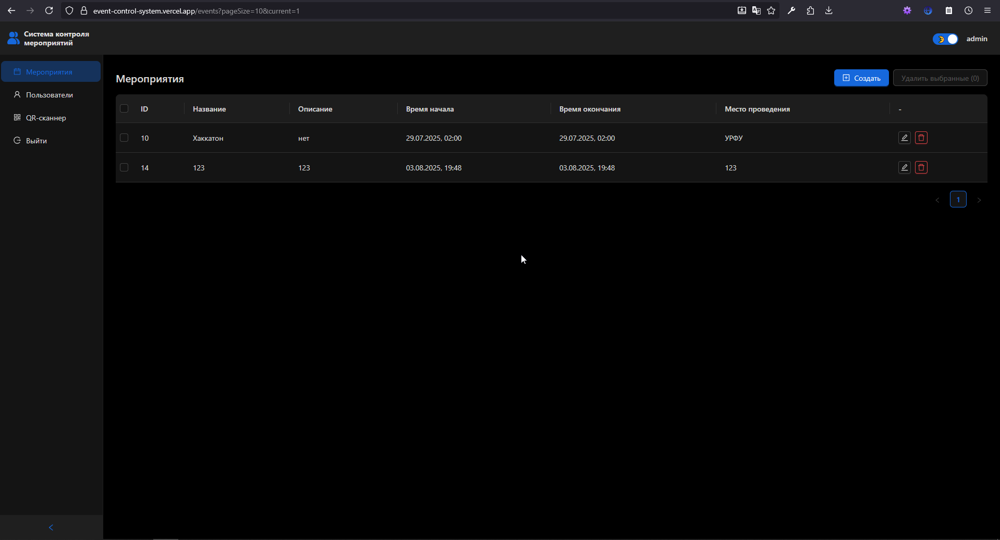
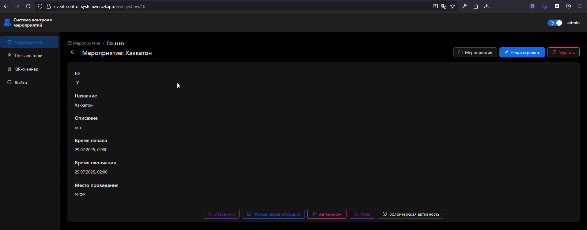
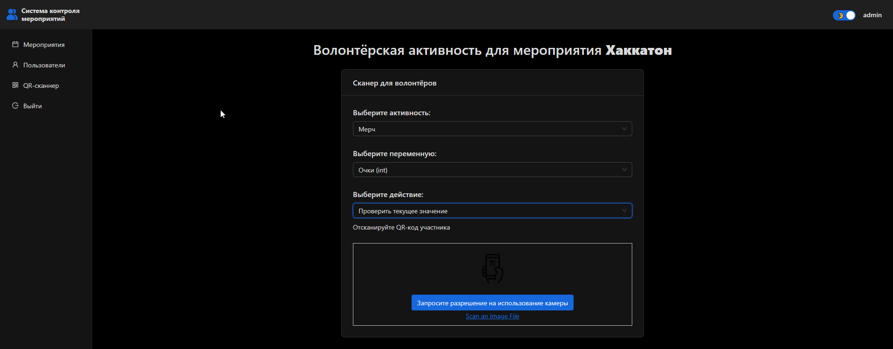

# Контроль мероприятий УРФУ





## Установка

Установите зависимости приложения командой:

```sh
npm install
```

## Режим разработки

Запустите приложение в режиме разработки командой:

```sh
npm run dev
```

## Режим продакшн

Соберите приложение для продакшна командой:

```sh
npm run build
```

## Запуск локального сервера

1. Распаковать архив
2. На компьютере должен быть установлен MySQL
3. Установить mysql-connector-python

```sh
pip install mysql-connector-python
```

4. В файле ProjectUrFU\EventControlUrFU\events\eventDB\eventDB.py прописать логин и пароль
5. В командной строке перейти в папку с ProjectUrFU
6. Прописать в cmd следующую команду:

```sh
python -m venv venv && .\venv\Scripts\activate.bat && python.exe -m pip install --upgrade pip && pip install -r requirements.txt
```

7. Перейти в папку проекта в командной строке

```sh
cd EventControlUrFU
```

8. Запустить бэк

```sh
python manage.py runserver
```
